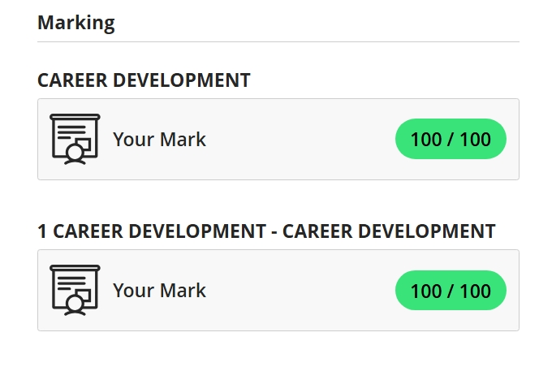
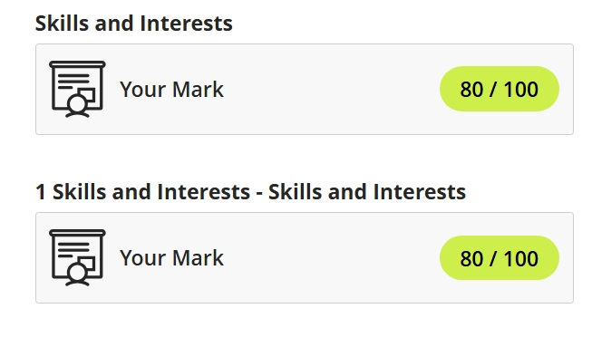
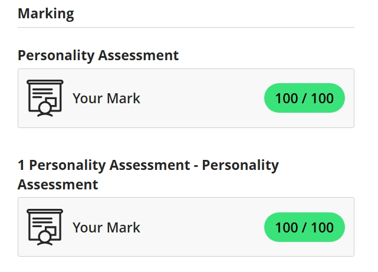
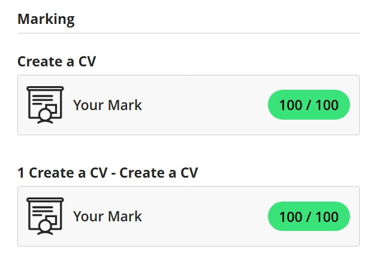

# Digital Portfolio 

Welcome to my Digital Portfolio. 
This portfolio highlights my career planning, skill development, and reflective growth using the **STAR Technique** (Situation, Task, Action, Result).
- Name:      Muaath 
- Surname:   Slamong 
---

## 📌 Table of Contents
- [Career Development](#career-development)
- [Skills and Interests](#skills-and-interests)
- [Personality Assessment](#personality-assessment)
- [Create a CV](#create-a-cv)
- [CV Submission](#cv-submission)

---

## Career Development

### Evidence

- Completed a career roadmap exercise.

### Reflection: STAR Technique  
**S**: I was unsure which IT career would best match my strengths and goals.  
**T**: I arranged development sessions to explore various career paths.  
**A**: I took part in career assessments and consultations to gain insights.  
**R**: I realized that Business Analysis and IT Project Management align well with my skills and interests.

---

## Skills and Interests

### Evidence

 Link to my FIGMA band management mobile app design: <a href="https://www.figma.com/design/ywF9Gns13VkHVchRLv4tHz/CovidBands?t=qsKuQMtPauqwxIAD-1">CovidBands</a> 
 Link to my FIGMA CPUT Marketplace website design: <a href="https://www.figma.com/design/BugIbpywr3Lrn4RaNOzuGf/CPUT-Marketplace-and-Exchange-Web-Application?t=qsKuQMtPauqwxIAD-1">CovidBands</a> 

### Reflection: STAR Technique  
**S**: I needed clarity on which technical and interpersonal skills I had developed.  
**T**: I reviewed my experiences and identified key skills from projects.  
**A**: I documented and evaluated the skills used in different tasks and scenarios.  
**R**: I recognized strengths in communication, analytical thinking, and proficiency in Python.

---

## Personality Assessment

### Evidence

 Link to my Mock Interview: <a href="https://github.com/MuaathSlamong-alt/MockInterviewVideoPRP3">Mock Interview</a> 

### Reflection: STAR Technique  
**S**: I wanted to understand how my personality influences my team dynamics.  
**T**: I undertook personality tests and group collaboration exercises.  
**A**: I reviewed results and gathered peer insights to validate findings.  
**R**: I found out that I am an INFJ, often contributing through supportive leadership and empathy.

---

## Create a CV

### Evidence

- Drafted CV using Microsoft Word

### Reflection: STAR Technique  
**S**: I needed to present a CV aligned with my updated career direction.  
**T**: I restructured my CV to highlight relevant projects and skills.  
**A**: I revised it based on feedback from peers and industry mentors.  
**R**: I now have a polished CV that effectively markets my qualifications.

---

## CV Submission

### Evidence
- [Link to CV](MuaathSlamongCV.pdf)

### Reflection: STAR Technique  
**S**: I aimed to finalize and submit a high-quality CV.  
**T**: I made final edits and checked it against job application standards.  
**A**: Ensured formatting, grammar, and keywords matched the target roles.  
**R**: My CV was accepted as-is and included in my professional portfolio.
